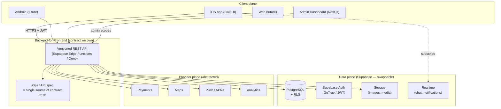
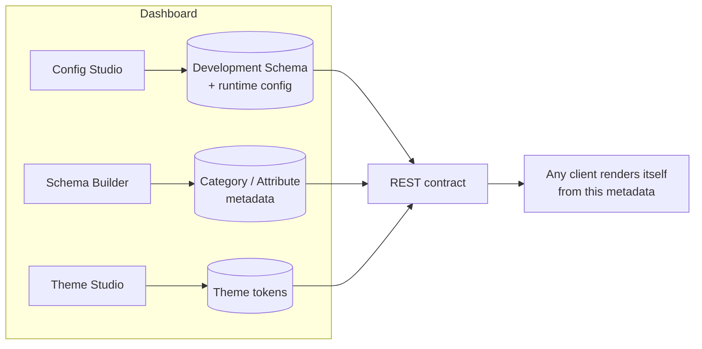
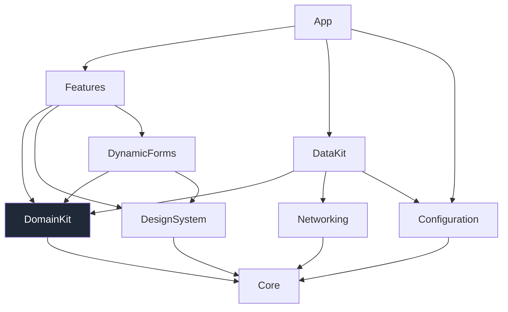
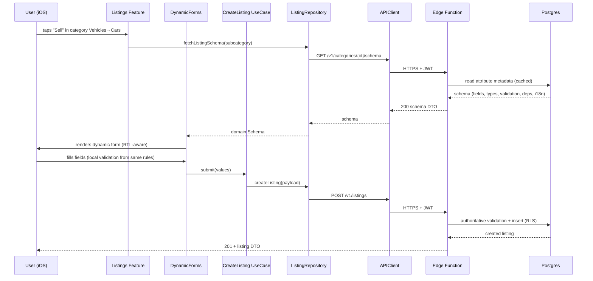

# 01 — System Architecture

## 1. High-level architecture

Four planes, one contract. The **API contract** (versioned REST + OpenAPI) is the spine; everything else plugs into it.



**Rules of the architecture:**
1. Clients speak **only** the REST contract. No client imports a Supabase SDK type into its domain/UI. (iOS may use the Supabase SDK *only inside the networking implementation* — see [ADR-0002](../adr/0002-backend-bff-edge-functions.md).)
2. The **OpenAPI spec is the contract of record.** Client models and (optionally) server handlers are generated from or validated against it. Contract changes are reviewed like schema changes.
3. **Business logic lives behind the contract** (Edge Functions + Postgres functions), never duplicated in clients.
4. **Providers are abstracted** behind ports; swapping Stripe→Tap or Apple Maps→Google is a backend/adapter change, invisible to clients where possible.

## 2. The three engines (system-level view)



- **Configuration & White-Label Engine** → *what the app is* (identity, locales, features, providers).
- **Theme Engine** → *how the app looks* (semantic tokens → live re-skin).
- **Dynamic Category & Attribute Engine** → *what the app sells* (category tree + per-subcategory listing schema).

A client boot sequence is: authenticate anonymously/known → fetch config bundle → fetch theme → fetch category/attribute metadata → render. All three are cached locally for offline, refreshed against ETag/version.

## 3. Repository structure (monorepo)

A single monorepo with strict path boundaries. Rationale in [ADR-0009](../adr/0009-monorepo.md). One source of truth for the contract, atomic cross-cutting changes, shared CI, easy for humans and AI agents to navigate.

```
marketplace-platform/
├── README.md
├── CHANGELOG.md
├── CONTRIBUTING.md
├── docs/
│   ├── planning/                 # this plan
│   ├── adr/                      # architecture decision records
│   ├── ARCHITECTURE.md           # (impl phase) living high-level doc
│   ├── SYSTEM_DESIGN.md
│   ├── DATABASE.md
│   ├── API.md
│   ├── BACKEND.md
│   ├── IOS_ARCHITECTURE.md
│   ├── WHITE_LABEL.md
│   ├── THEME_ENGINE.md
│   ├── CONFIGURATION_ENGINE.md
│   ├── MODULES.md
│   ├── SECURITY.md
│   ├── TESTING.md
│   ├── DEPLOYMENT.md
│   └── ROADMAP.md
│
├── contract/                     # ⭐ the spine — shared across all platforms
│   ├── openapi/                  # versioned OpenAPI specs (v1/…)
│   ├── schema/                   # JSON Schema for Development Schema + config
│   └── examples/                 # canonical request/response fixtures
│
├── configs/                      # Development Schemas (per environment / client)
│   ├── development/
│   ├── staging/
│   ├── production/
│   └── clients/
│       ├── default/              # canonical reference config (CI target)
│       ├── client_a/
│       └── client_b/
│
├── ios/                          # Swift Package Manager workspace
│   ├── App/                      # thin app target (composition root)
│   ├── Packages/
│   │   ├── Core/                 # foundation: DI, logging, errors, utils
│   │   ├── DesignSystem/         # theme engine + UI components
│   │   ├── Networking/           # APIClient, APIEndpoint, interceptors
│   │   ├── Configuration/        # config engine + Development Schema models
│   │   ├── DomainKit/            # entities + use cases + repository protocols
│   │   ├── DataKit/              # repository implementations, DTOs, mappers
│   │   ├── DynamicForms/         # schema-driven form/filter renderer
│   │   └── Features/             # one SPM target per feature module
│   │       ├── Authentication/
│   │       ├── Listings/
│   │       ├── Search/
│   │       └── …
│   └── Tooling/                  # Fastlane, codegen, white-label scripts
│
├── backend/
│   ├── supabase/
│   │   ├── migrations/           # versioned SQL migrations
│   │   ├── functions/            # Edge Functions (the BFF)
│   │   ├── seed/                 # reference data + default config seeding
│   │   └── policies/             # RLS policies (as reviewed SQL)
│   ├── src/                      # shared Deno/TS domain code for functions
│   └── tests/                    # contract + integration tests
│
├── dashboard/                    # Next.js admin CMS
│   ├── app/                      # App Router
│   ├── src/
│   └── ...
│
├── packages/                     # cross-platform shared TS (contract types, validators)
│   ├── contract-types/           # generated from openapi + json-schema
│   └── config-validation/        # validates Development Schemas in CI
│
└── tooling/                      # repo-wide scripts, codegen, CI helpers
```

**Key structural principle:** `contract/` and `configs/` are **platform-neutral** and sit above `ios/`, `backend/`, `dashboard/`. They are the shared truth; each platform generates its own bindings from them.

## 4. Module boundaries & dependency rules

Dependencies point **inward toward the domain** and **downward toward the contract**. Nothing points back out.



**Allowed-dependency table (iOS):**

| Module | May depend on | Must NOT depend on |
|---|---|---|
| `Core` | — (Foundation only) | anything in-repo |
| `DomainKit` | `Core` | Networking, DataKit, DesignSystem, Supabase |
| `Networking` | `Core` | DomainKit, Features, DesignSystem |
| `Configuration` | `Core`, `Networking` | Features, DesignSystem |
| `DesignSystem` | `Core`, `Configuration` (tokens) | Networking, DomainKit, Features |
| `DataKit` | `DomainKit`, `Networking`, `Configuration` | DesignSystem, Features |
| `DynamicForms` | `DomainKit`, `DesignSystem` | Networking, DataKit |
| `Features/*` | `DomainKit`, `DesignSystem`, `DynamicForms` | **other Features**, Networking (direct), Supabase |
| `App` | everything (composition root) | — |

The **"Features must not depend on other Features"** rule is what keeps modules independent. Cross-feature interaction happens via (a) `DomainKit` use cases/protocols and (b) navigation events through the coordinator — never a direct import. See [02 — iOS Architecture](02-ios-architecture.md).

**Enforcement:** SPM target boundaries make illegal imports fail to compile. We add a CI lint that greps for `import Supabase` outside `Networking`, and a package-graph assertion test. On the backend, the OpenAPI validator + RLS test suite enforce the contract boundary.

## 5. End-to-end dependency graph (system)

```mermaid
flowchart LR
  Config[configs/*] --> ContractS[contract/schema]
  ContractS --> Validate[config-validation CI]
  ContractO[contract/openapi] --> GenIOS[iOS DTO codegen]
  ContractO --> GenTS[TS contract-types]
  GenIOS --> Networking
  GenTS --> Dashboard
  GenTS --> Backend
  Backend --> DB[(Postgres)]
  Backend --> Contract Impl
  iOS[iOS app] --> Backend
  Dashboard --> Backend
```

The build order that falls out of this graph is exactly the roadmap order: **contract & config first → backend + DB → dynamic schema engine → iOS foundation → features → dashboard**. See [11 — Roadmap](11-roadmap.md).

## 6. Data-flow example: creating a listing (schema-driven)



Note: the **form is never coded per vertical**. The same renderer produces the cars form and the apartments form from different metadata. This is the platform's core proof.

## 7. Non-goals for the platform architecture

- Not a general no-code app builder — it builds *marketplace* apps specifically.
- Not multi-backend-simultaneously — one active backend provider per deployment (abstraction allows swapping, not running many at once).
- Not offline-first write (v1) — offline is read/cache; writes require connectivity. Offline write queue is a later, opt-in capability.
