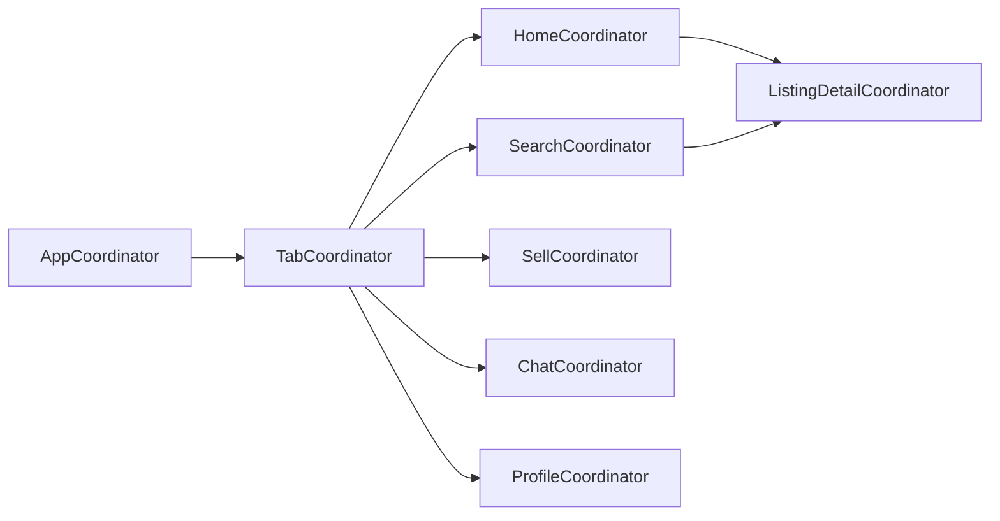

# 02 — iOS Architecture

**Stack (fixed by foundation):** SwiftUI · iOS 17+ · Swift Concurrency (async/await, actors) · Clean Architecture · MVVM-C · Coordinator pattern · Factory DI · Swift Package Manager modularization · SwiftData (local cache) · protocol-oriented · SOLID.

## 1. Layered architecture

Strict Clean Architecture. The **dependency rule**: source-code dependencies point only inward. Domain knows nothing about UI, networking, or persistence.

```mermaid
flowchart TB
  subgraph Presentation
    V[SwiftUI View]
    VM[ViewModel<br/>@Observable]
    C[Coordinator]
  end
  subgraph Domain["Domain (pure Swift, no imports)"]
    UC[UseCases]
    E[Entities]
    RP[Repository<br/>Protocols]
  end
  subgraph Data
    RI[Repository<br/>Implementations]
    DTO[DTOs + Mappers]
    DS[DataSources<br/>remote / local]
  end
  subgraph Infrastructure
    NET[Networking<br/>APIClient/APIEndpoint]
    DB[(SwiftData cache)]
  end

  V --> VM --> UC --> RP
  C -.navigation.-> V
  RI -.implements.-> RP
  UC --> E
  RI --> DTO --> DS
  DS --> NET
  DS --> DB
```

| Layer | Responsibility | Depends on | Never imports |
|---|---|---|---|
| **Presentation** | Render state, capture intent, navigate | Domain (use cases, entities) | Networking, SwiftData, Supabase |
| **Domain** | Business rules, entities, use case protocols | nothing (Foundation-only) | everything else |
| **Data** | Fulfil repository protocols, map DTO↔Entity, cache policy | Domain, Networking, Configuration | DesignSystem, Presentation |
| **Infrastructure** | HTTP, tokens, persistence, Supabase SDK (isolated) | Core | Domain, Presentation |

### Why Clean Architecture ([ADR-0001](../adr/0001-clean-architecture-ios.md))
- **Alternative A — MV/"vanilla SwiftUI" with `@Observable` models talking to services.** Less boilerplate, faster initially. Rejected: business rules leak into views, backend swap and multi-client reuse become impossible, testing needs the UI.
- **Alternative B (chosen) — Clean + MVVM-C.** More layers/boilerplate, but the domain is pure and portable, use cases are unit-testable without UI or network, and the mandated Supabase-independence is structurally guaranteed. Matches the "product for years" goal.

## 2. MVVM-C and the Coordinator pattern

- **View** — dumb SwiftUI, no logic beyond layout/animation. Binds to a ViewModel.
- **ViewModel** — `@Observable` (iOS 17 Observation), `@MainActor`, holds view state + calls use cases. **No navigation, no networking, no `NavigationStack` knowledge.** Emits *navigation intents*.
- **Coordinator** — owns a `NavigationPath`/routing, translates intents into navigation, wires child coordinators. Keeps ViewModels ignorant of the nav graph and prevents "massive ViewModels/Coordinators" (foundation's explicit anti-goals) by **one coordinator per feature flow**, composed by a root `AppCoordinator`.



**Cross-feature navigation** (e.g., Search → Listing Detail → Seller Profile → Chat) is expressed as *route enums* handled by a parent coordinator, so `Search` never imports `Chat`. Deep links resolve to the same route enums.

**Navigation approach decision:** SwiftUI `NavigationStack` + type-safe `NavigationPath` with `Hashable` route values, driven by coordinators. Alternative (UIKit `UINavigationController` bridged) rejected for a greenfield iOS-17 app — adds bridging complexity for little gain now that `NavigationStack` is mature.

## 3. Dependency Injection — Factory

- **Choice:** [Factory](https://github.com/hmlongco/Factory) — compile-time-safe, lightweight, container-based DI. Fits SPM modularization and previews/tests (easy per-test overrides).
- **Alternatives considered:**
  - *Manual constructor injection only* — purest, zero deps, but wiring the whole graph by hand at the composition root becomes unwieldy across ~20 feature modules.
  - *swift-dependencies (Point-Free)* — excellent, but opinionated around its ecosystem/TCA; heavier conceptual load.
  - **Factory (chosen)** — minimal, unopinionated, plays well with MVVM-C and constructor injection; registrations live in the composition root, resolutions stay testable. See [ADR-0012](../adr/0012-dependency-injection.md).
- **Rule:** feature modules declare *protocol* dependencies; the **App target (composition root)** registers concrete implementations. This is where "swap Supabase for X" is realized — only the composition root changes.

## 4. Swift Package Manager modularization

Every box in [01 §3](01-system-architecture.md#3-repository-structure-monorepo) is an SPM target. Benefits: enforced boundaries (illegal import = compile error), parallel builds, independent testability, faster incremental builds, and clear ownership.

**Module layers:**
1. **Foundation packages:** `Core` (DI facade, logging, error model, result types, date/locale utils).
2. **Capability packages:** `Networking`, `Configuration`, `DesignSystem`, `DynamicForms`, `DomainKit`, `DataKit`.
3. **Feature packages:** `Features/Authentication`, `Features/Listings`, … each with its own `README/Architecture/Flow/API/Testing/Future.md` per the foundation's repository standard.

Each feature package exposes a small public surface: a `Coordinator` factory, its route enum, and its DI registrations. Internals are `internal` by default.

## 5. Local persistence — SwiftData as a cache, not a source of truth

- **Role:** SwiftData is an **offline read cache** for config, theme, category/attribute metadata, and recently viewed listings — never the authoritative store (backend is). Writes go to the backend; the cache is invalidated/refreshed by version/ETag.
- **Alternatives:** Core Data (more mature, more boilerplate), GRDB/SQLite (powerful queries, manual mapping), plain file cache (simple, no query). **SwiftData chosen** ([ADR-0013](../adr/0013-local-persistence.md)) for native iOS-17 integration, `@Model` ergonomics, and Swift Concurrency support — with the caveat that all cache access is behind repository protocols so it can be swapped if SwiftData limitations bite.
- **Cache policy per data type:**

| Data | Strategy | TTL / invalidation |
|---|---|---|
| Development config / theme | cache-then-network, version-gated | on config version bump |
| Category/attribute metadata | cache-then-network | on schema version bump |
| Listings feed | network-first, cache fallback | short TTL + pull-to-refresh |
| Listing detail | cache after view | medium TTL |
| User/session | Keychain (not SwiftData) | on token refresh |

## 6. Dynamic form rendering (the iOS side of the flagship)

`DynamicForms` is a dedicated module that turns backend attribute metadata into SwiftUI forms and filters. It is the iOS realization of the [Dynamic Category & Attribute Engine](05-dynamic-schema-engine.md).

- Input: a domain `ListingSchema` (attribute groups → fields → type + validation + dependencies + i18n labels).
- Output: a rendered, validated form producing a typed value payload.
- **Field-type registry:** each field type (`text`, `number`, `dropdown`, `multiselect`, `date`, `boolean`, `media`, `location`, …) maps to a `FieldRenderer` conforming to a protocol. Adding a field type = adding one renderer, no changes to callers (Open/Closed).
- **Dependencies:** e.g. *Model depends on Brand* — the renderer reacts to a dependency graph, filtering/loading dependent options when a parent changes.
- **Validation:** rules travel *with* the metadata; the same rules drive local (optimistic) and are re-enforced server-side. No client-authored validation logic per vertical.
- **RTL/i18n:** the renderer is locale-aware from the start (mirroring, bidi text, number/date/currency formatting).

This module is what makes "add a Jobs category with new fields, no app release" true.

## 7. Concurrency model

- **`async/await` everywhere**; repositories/use cases are `async`. No completion handlers in new code.
- **`@MainActor`** on ViewModels; UI state mutation stays on main.
- **Actors** for shared mutable infrastructure (token store, cache coordinator, in-flight request de-duplication).
- **Structured concurrency** (`async let`, `TaskGroup`) for parallel fan-out (e.g., boot: fetch config + theme + schema concurrently).
- **Cancellation** honored through the use-case → repository → APIClient chain (SwiftUI `.task` ties lifetime to view).
- **Sendable** correctness enforced (strict concurrency checking on) so the modular graph stays data-race-free.

## 8. Error handling

A single `DomainError` taxonomy in `Core`/`DomainKit` (e.g., `.network`, `.unauthorized`, `.validation([FieldError])`, `.notFound`, `.server`, `.offline`, `.decoding`). The Networking layer maps HTTP/transport errors and the standard API error envelope (see [08 §Errors](08-api-auth.md)) into `DomainError`. Presentation maps `DomainError` → localized, themed UI states (Error/Offline/Empty components from the design system). Validation errors map field-by-field back onto the dynamic form.

## 9. Composition root & white-label wiring

The **App target** is the only place that:
- reads the active build-time Development Schema,
- registers concrete implementations (Supabase-backed `APIClient`, real providers) into Factory,
- selects the initial coordinator and theme.

This is what lets one codebase become client_a or client_b: the app target's inputs (schema, assets, entitlements) differ per client; nothing else does. See [07 — Configuration/White-Label/Theme](07-configuration-whitelabel-theme.md).

## 10. Testing hooks (detail in [09](09-cross-cutting.md))
- Use cases: pure unit tests with fake repositories.
- ViewModels: unit tests with fake use cases; assert emitted state + navigation intents.
- Repositories: tests against a mock `APIClient` + snapshot DTO fixtures from `contract/examples`.
- DynamicForms: snapshot tests across representative schemas (cars, apartments, phones) incl. RTL.
- DI: a test that resolves the entire graph to catch missing registrations.
