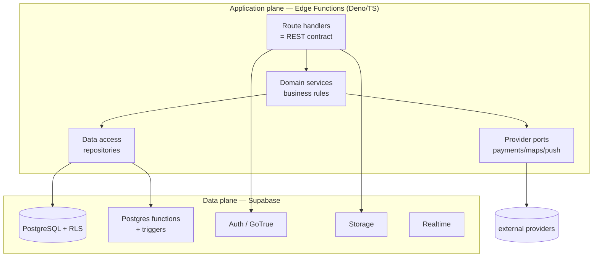
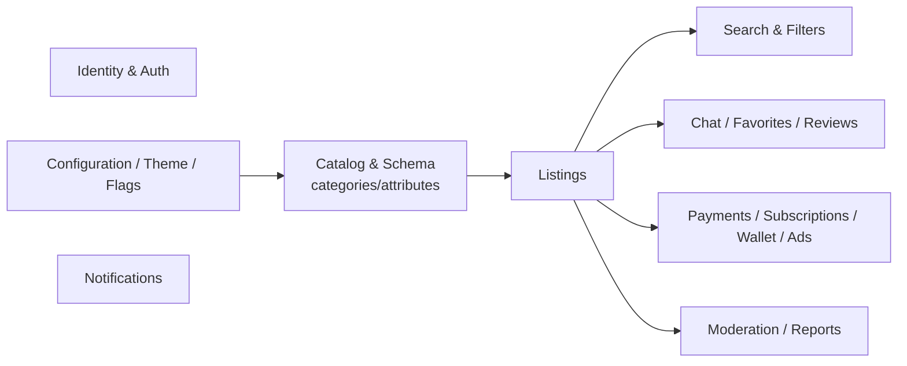
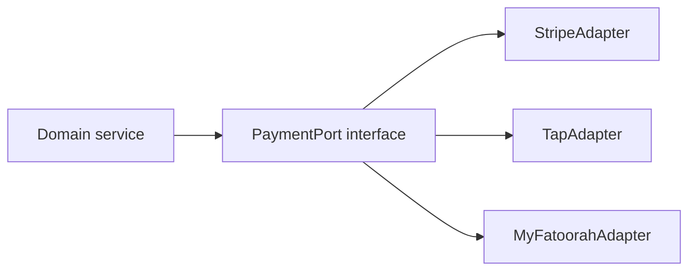

# 03 — Backend Architecture

**Model:** Supabase is the **data plane**; a **BFF implemented as Supabase Edge Functions** is the **application/contract plane**. Clients speak only the versioned REST contract. Full rationale and alternatives in [ADR-0002](../adr/0002-backend-bff-edge-functions.md).

## 1. Layered backend



**Placement of business logic (decision):**

| Logic type | Where it lives | Why |
|---|---|---|
| Request orchestration, authz decisions, provider calls, DTO shaping | **Edge Function services** | Portable app logic; the part we'd re-host on NestJS/Go later |
| Data integrity, invariants, derived columns, listing-attribute validation, counters | **Postgres (constraints, triggers, functions, generated columns)** | Closest to data, transactional, can't be bypassed |
| Row visibility / ownership / tenant isolation | **RLS policies** | Defense-in-depth; enforced even if a handler is buggy |

Principle: **the database enforces truth; Edge Functions enforce workflow.** We deliberately keep *some* logic in Postgres (validation of dynamic attribute values, integrity) because it is transactional and un-bypassable — but the **contract** stays the stable, portable asset, so re-hosting the app plane elsewhere later doesn't change clients.

## 2. Edge Function organization

```
backend/supabase/functions/
├── _shared/                # shared runtime: auth middleware, error envelope,
│   ├── auth.ts             # JWT verify, scope/role checks
│   ├── errors.ts           # standard error envelope + mapping
│   ├── validation.ts       # zod schemas generated from contract
│   ├── db.ts               # typed data-access helpers
│   └── ports/              # payment/maps/push adapters (interfaces + impls)
├── v1-config/              # GET config bundle (Development Schema runtime slice)
├── v1-catalog/             # categories, attributes, schema metadata (read)
├── v1-listings/            # CRUD + search
├── v1-auth/                # session bootstrap, profile, provider linking
├── v1-chat/                # conversations, messages (writes; reads via Realtime)
├── v1-favorites/
├── v1-admin-catalog/       # dashboard: manage categories/attributes (admin scope)
├── v1-admin-config/        # dashboard: manage config/theme/flags (admin scope)
└── v1-webhooks/            # payment/provider callbacks
```

- **One function group per bounded context**, each mapping to a slice of the OpenAPI spec.
- **`_shared`** guarantees a single implementation of auth, error envelope, and validation — no drift across endpoints.
- **Admin endpoints are separate functions** with distinct scope requirements, so a public-token request can never reach an admin handler.

### Why not just PostgREST directly?
Supabase auto-exposes tables via PostgREST. Tempting for reads. **Decision:** the app must never bind to PostgREST's shape (it leaks table structure and Supabase specifics). We allow PostgREST **only** for internal/admin tooling or behind our own APIEndpoint where the response is re-shaped to the contract — never as the public app contract. This preserves portability.

## 3. Read vs. write paths

- **Writes** always go through Edge Functions (validation, business rules, side effects, audit).
- **Reads**: default through Edge Functions for contract stability and shaping. High-volume, simple reads (e.g., listing feed) may use a **cached, contract-shaped read function** backed by SQL views/materialized views. We do **not** expose raw PostgREST to clients.
- **Realtime reads** (chat messages, live notifications) use Supabase Realtime channels, but the **channel/topic naming and payload shape are part of our contract** and documented like REST endpoints, so Realtime can be swapped (e.g., for a socket service) later.

## 4. Business capabilities (bounded contexts)



Each context owns its tables, functions, RLS, and endpoint group. Contexts communicate via well-defined calls, not by reaching into each other's tables. `Catalog & Schema` is upstream of nearly everything — it defines the shape of listings.

## 5. Storage (media)

- Images/media in **Supabase Storage**, organized by tenant/listing; **signed URLs** issued by Edge Functions; direct anonymous access disabled.
- Uploads: client requests a **signed upload URL** from an Edge Function (authz + quota checked), uploads directly to Storage, then confirms; the function records the media row and can trigger post-processing (thumbnails/moderation) via a Postgres trigger or queued job.
- The client only knows the contract endpoints (`POST /v1/media/upload-url`, `POST /v1/media/confirm`), never Storage internals.

## 6. Realtime (chat & notifications)

- **Chat:** conversations/messages persisted in Postgres; clients subscribe to a Realtime channel per conversation (RLS-guarded). Message sends go through an Edge Function (validation, moderation hooks, push fan-out).
- **Notifications:** an outbox table + Realtime channel per user; push (APNs) fan-out via a provider port. This keeps notifications backend-driven and consistent across platforms.

## 7. Provider ports (payments, maps, push, analytics)

Each external provider sits behind a **port interface** in `_shared/ports`. The active implementation is selected by the deployment's config (Development Schema). This is the backend mirror of the client's provider-agnostic design and makes Gulf-specific providers (Tap, HyperPay, MyFatoorah) swappable with Stripe.



## 8. Configuration & multi-environment

- **Environments:** development / staging / production, each a distinct Supabase project (or branch). Config differences captured in `configs/{env}` Development Schemas.
- **Secrets:** provider keys in Supabase function secrets / environment, never in the repo. The Development Schema references provider *selection*, not secrets.
- **Tenancy:** default single-tenant-per-deployment ([ADR-0011](../adr/0011-multi-tenancy.md)); schema carries `tenant_id` so a shared deployment is possible later.

## 9. Portability guarantees (how we honor "replace Supabase later")

1. The **OpenAPI contract** is provider-neutral and versioned; it is the asset clients depend on.
2. Edge Function **services/repositories** are structured so the app plane (routing + domain services) could be lifted onto NestJS/Go with a new data-access adapter.
3. Supabase-specific features (RLS, Realtime, Storage) are **wrapped** behind our own semantics (auth middleware, channel contract, media endpoints) — never leaked to clients.
4. A **contract conformance test suite** runs against the live BFF, so any re-host can be validated by re-running it.

## 10. Observability & ops (summary; detail in [09](09-cross-cutting.md))
- Structured logs from every function with a request id; correlation id propagated from clients.
- Metrics: latency/error rate per endpoint, DB query timings, function cold-start rate.
- Audit log table for all admin/config/schema mutations (who changed the marketplace structure, when).
- Migrations are versioned SQL, reviewed, and run via CI; no manual production DB edits.
