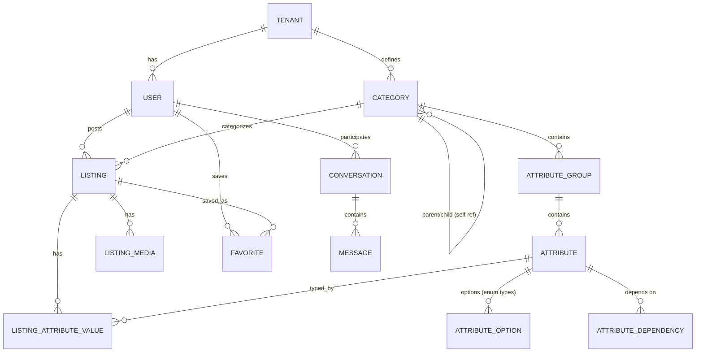

# 04 — Database Architecture

PostgreSQL (via Supabase). This document covers the overall schema, tenancy, RLS, indexing, and migrations. The **dynamic category/attribute tables are detailed in [05](05-dynamic-schema-engine.md)** and only summarized here.

## 1. Schema domains (logical grouping)

We use Postgres **schemas** to group tables by bounded context and keep the public surface clean:

| Postgres schema | Contents |
|---|---|
| `identity` | users profile extension, roles, sessions metadata (auth base in Supabase `auth`) |
| `catalog` | categories, subcategories, attribute groups, attributes, attribute options, dependencies (⭐ the engine) |
| `listing` | listings, listing attribute values, media, status history |
| `social` | conversations, messages, favorites, reviews, reports |
| `commerce` | subscriptions, plans, wallet, transactions, ads |
| `config` | development schema snapshots, feature flags, theme tokens, localized strings |
| `moderation` | moderation queue, decisions, audit |
| `platform` | tenants, audit log, outbox, migrations metadata |

## 2. Entity overview (core)

The **category self-reference** models unlimited category→subcategory nesting. Each category node can carry attribute groups; a listing's leaf category determines its schema.

## 3. Tenancy model

**Default: single-tenant-per-deployment** (one Supabase project per client) for isolation, per-country data residency/regulatory simplicity, and blast-radius containment. **But every domain table still carries `tenant_id`** so the exact same schema can run as shared multi-tenant later without migration. Rationale + trade-offs in [ADR-0011](../adr/0011-multi-tenancy.md).

- `platform.tenant` row exists even in single-tenant mode (one row).
- `tenant_id` defaults from a session claim; RLS filters every query by it.
- Switching to shared multi-tenant = enabling more tenant rows + tenant-scoped auth; no structural change.

## 4. Row-Level Security (RLS)

RLS is **on for every table**; the default policy is deny. Policies are written as reviewed SQL in `backend/supabase/policies/` and tested.

**Policy patterns:**

| Data | Read | Write |
|---|---|---|
| Published listings | anyone in tenant (incl. anon) | owner only |
| Draft/pending listings | owner + moderators | owner (draft), moderators (status) |
| Category/attribute metadata | anyone in tenant (read) | admin scope only |
| Config / theme / flags | anyone in tenant (runtime slice) | admin scope only |
| Conversations/messages | participants only | participants only |
| Favorites | owner only | owner only |
| Moderation queue | moderators/admins only | moderators/admins only |
| Audit log | admins only | insert-only via triggers |

**Defense in depth:** even though Edge Functions already authorize requests, RLS is the backstop — a bug in a handler cannot leak cross-user or cross-tenant data.

## 5. The dynamic attribute value store (summary)

The hard problem — storing values for schemas defined at runtime — is solved with a **hybrid model** (full detail + benchmarks rationale in [05](05-dynamic-schema-engine.md) and [ADR-0003](../adr/0003-dynamic-attribute-engine.md)):

- `catalog.attribute` defines each field: `data_type`, `input_type`, validation JSON, i18n labels, ordering, required, dependencies.
- `listing.listing_attribute_value` stores values in **typed columns** (`value_text`, `value_number`, `value_bool`, `value_date`, `value_option_id`, `value_json`) keyed by `(listing_id, attribute_id)` — typed, indexable, no casting soup.
- A **denormalized `listing.attributes_index` JSONB column** on `listing` mirrors values for fast, flexible filtering via **GIN + expression/generated-column indexes**.
- **Search projection:** Postgres FTS (`tsvector`) column now; pluggable external search (Meilisearch/Typesense) later behind the same search endpoint.

This gives dashboard-defined schemas (write-flexible) **and** fast typed filtering (read-performant) — the two requirements that usually conflict in EAV designs.

## 6. Indexing strategy

- B-tree on all FKs and status/date columns used in feeds.
- **GIN** on `attributes_index` (JSONB) and on `tsvector` search columns.
- **Partial indexes** for hot predicates (e.g., `WHERE status='published'`).
- **Generated columns + btree** for the highest-traffic filterable attributes per vertical (e.g., car price, year) — created by the schema engine when an attribute is marked "filterable/high-cardinality".
- Composite indexes matching the canonical feed/filter query shapes (category + status + created_at, plus attribute predicates).

## 7. Data integrity

- FK constraints everywhere; `ON DELETE` chosen per relationship (restrict for catalog, cascade for listing children).
- **CHECK constraints** and **triggers** enforce attribute-value/type correctness against the attribute definition (a `number` attribute can't store text).
- Enums for closed sets that are *not* user-configurable (e.g., listing lifecycle status); user-configurable sets (categories, attribute options) are **tables**, never enums.
- Counters (favorites count, views) maintained by triggers or periodic jobs, not client math.

## 8. Migrations

- **Versioned SQL migrations** in `backend/supabase/migrations/`, forward-only, reviewed in PRs, applied by CI to staging then production.
- Every migration is idempotent-safe and paired with a rollback note.
- **Schema/config seeds** (`backend/supabase/seed/`) install the default reference marketplace (category tree + attributes + default config/theme) so a fresh environment boots into a working marketplace.
- No manual production edits; the DB state is reproducible from migrations + seeds.

## 9. Auditability

- `platform.audit_log` records every mutation to catalog, config, theme, flags, and moderation decisions: actor, action, before/after (JSON), timestamp, request id. Insert-only via triggers.
- This is a product requirement: since non-engineers reshape the marketplace via the dashboard, "who changed the Cars schema last Tuesday" must be answerable.

## 10. Backups & residency
- Rely on Supabase automated backups + PITR for v1; documented restore runbook.
- Per-deployment isolation supports per-country data residency (choose the Supabase region per client).
- Larger scale (read replicas, partitioning of `listing`/`message` by tenant/date) considered in [09 — Scalability](09-cross-cutting.md#scalability).
