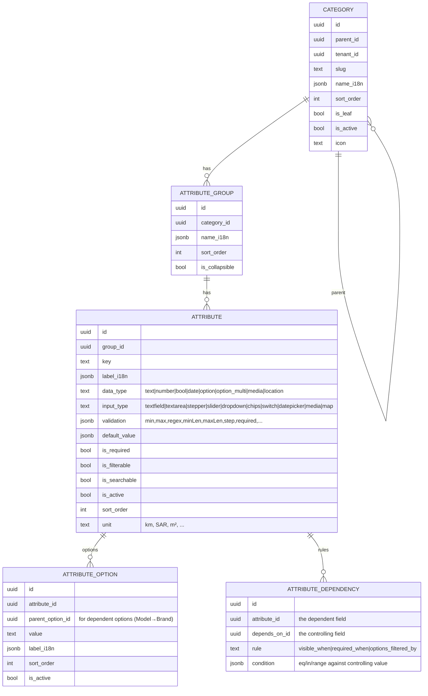

# 05 — Dynamic Category & Attribute Engine ⭐

> This is the platform's flagship capability and its highest technical risk. The marketplace's structure — categories, subcategories, and the **listing schema of every subcategory** — is **data owned by the dashboard**, not code. Clients render create/edit forms, filters, and detail views **from backend metadata**. Adding "Jobs" with new fields, or adding "Battery Health" to Phones, is a dashboard action with **no app release**.

Design principle: **schema-driven, never screen-driven.** There is exactly one create-listing screen; it renders any vertical.

## 1. Requirements (from your brief)

The dashboard must let admins:
- Create categories, subcategories (unlimited nesting).
- Create attribute groups and custom attributes.
- Choose field types: text, number, dropdown, date, boolean, multiselect, media, and more.
- Define validation rules, required/optional, ordering, default values.
- Define **dependencies** between fields (e.g., *Model depends on Brand*).
- Localize attribute names/options (Arabic/English at minimum, RTL).
- Enable/disable attributes.

Clients (iOS/Android/Web) must render these dynamically. The engine must also power **filtering/search** on those attributes.

## 2. The core modeling decision (hybrid), with alternatives

Storing values for schemas unknown at compile time is the classic hard problem. Three approaches:

| Approach | Write flexibility | Query/filter performance | Integrity | Verdict |
|---|---|---|---|---|
| **A. Pure EAV** (one tall `value` table, all-text) | ★★★ | ★ (casting soup, slow filters) | ★ (no typing) | Rejected — becomes unqueryable at scale |
| **B. Pure JSONB blob** on `listing` | ★★★ | ★★ (GIN helps, but weak typing/constraints) | ★ | Good for storage, weak for typed integrity & per-field constraints |
| **C. Hybrid (chosen)** — typed value table **+** JSONB projection **+** generated columns for hot fields | ★★★ | ★★★ | ★★★ | **Chosen** |

**Chosen: C — Hybrid.** Rationale in [ADR-0003](../adr/0003-dynamic-attribute-engine.md):
- **Definitions are normalized** first-class tables (dashboard edits these).
- **Values are stored typed** in `listing_attribute_value` (one row per attribute per listing, with typed columns) → integrity + indexable.
- A **denormalized JSONB `attributes_index`** on `listing` mirrors values for flexible GIN-indexed filtering and single-read hydration.
- The engine **promotes hot filterable attributes to generated columns** with btree indexes for the fastest predicates.

This resolves the usual EAV trap: we keep write-flexibility *and* get read-performance.

## 3. Definition schema (what the dashboard edits)



**Notes:**
- `data_type` = storage/semantic type; `input_type` = how it renders. Decoupling them lets one type render many ways (a `number` as stepper *or* slider).
- **Dependent options** (Model depends on Brand) are modeled via `parent_option_id` on options *plus* an `options_filtered_by` dependency — so choosing Brand=BMW filters Model options to BMW's.
- **i18n** everywhere: `name_i18n`/`label_i18n` are JSONB maps `{ "en": "...", "ar": "..." }`. Options are localized too.
- **Versioning:** category/attribute definitions carry a `schema_version` (bumped on change) so clients cache-invalidate and so historical listings keep their original schema semantics.

## 4. Value schema (what a listing stores)

```sql
-- typed value store (integrity + indexable)
listing.listing_attribute_value (
  listing_id     uuid  references listing.listing,
  attribute_id   uuid  references catalog.attribute,
  value_text     text,
  value_number   numeric,
  value_bool     boolean,
  value_date     date,
  value_option_id uuid references catalog.attribute_option,   -- single-select
  value_option_ids uuid[],                                     -- multiselect
  value_json     jsonb,                                        -- media refs, location, etc.
  primary key (listing_id, attribute_id)
)

-- denormalized projection for fast filtering + single-read hydration
listing.listing (
  ...,
  attributes_index jsonb   -- { "brand":"bmw","year":2019,"mileage":84000,"transmission":"automatic" }
  -- GIN index on attributes_index; generated columns for hot fields (price, year) with btree
)
```

- A trigger keeps `attributes_index` in sync with `listing_attribute_value` on write.
- **Type enforcement:** a trigger validates each value against its `attribute.data_type` and `validation` JSON, so bad data can't enter even if a handler is buggy.

## 5. Metadata contract (client-facing)

Clients fetch the schema for a category/subcategory as one composed document. This is the contract that `DynamicForms` renders.

```
GET /v1/categories/tree                      # full category tree (i18n, icons)  [cacheable, versioned]
GET /v1/categories/{id}/schema?locale=ar     # composed listing schema for a subcategory
```

Response (shape, abbreviated):
```jsonc
{
  "schemaVersion": 42,
  "category": { "id": "...", "name": "Cars", "path": ["Vehicles","Cars"] },
  "groups": [
    {
      "id": "...", "name": "Details", "collapsible": false,
      "fields": [
        {
          "key": "brand", "label": "Brand", "dataType": "option", "inputType": "dropdown",
          "required": true, "filterable": true, "sortOrder": 1,
          "options": [ { "id":"...","value":"bmw","label":"BMW" }, ... ],
          "validation": { "required": true }
        },
        {
          "key": "model", "label": "Model", "dataType": "option", "inputType": "dropdown",
          "required": true, "sortOrder": 2,
          "dependsOn": [ { "field": "brand", "rule": "options_filtered_by" } ],
          "options": []            // lazily loaded per selected brand, or inlined if small
        },
        {
          "key": "mileage", "label": "Mileage", "dataType": "number", "inputType": "stepper",
          "unit": "km", "validation": { "min": 0, "max": 2000000 }, "sortOrder": 4
        }
      ]
    }
  ]
}
```

**Design choices:**
- Schema is **composed server-side** (category + its groups + attributes + options + dependencies) so clients do one request.
- **Locale-resolved server-side** (`?locale=`) with the raw i18n map available when needed — clients don't juggle translation logic.
- **`schemaVersion`** enables ETag/`If-None-Match` caching; a 304 means "your cached form is current."
- Large option sets (car models, cities) are **paginated/lazy** via `GET /v1/attributes/{id}/options?parent=<brandId>&q=<search>`.

## 6. Dynamic form rendering (client)

The iOS `DynamicForms` module (mirrored on Android/Web) is a **field-type registry**:

```
FieldRenderer (protocol)
 ├─ TextFieldRenderer        (text/textfield, textarea)
 ├─ NumberRenderer           (number/stepper, slider)
 ├─ DropdownRenderer         (option/dropdown)
 ├─ ChipsRenderer            (option_multi/chips)
 ├─ SwitchRenderer           (bool/switch)
 ├─ DateRenderer             (date/datepicker)
 ├─ MediaRenderer            (media/gallery upload)
 └─ LocationRenderer         (location/map)
```

- **Open/Closed:** a new field type = a new renderer registered in a map keyed by `(dataType,inputType)`. No changes to the form engine, use cases, or backend contract shape.
- **State:** a `FormState` actor holds current values, computes visibility/required via the dependency graph, and produces the typed submit payload.
- **Dependencies** are evaluated reactively: when `brand` changes, `model` renderer reloads options (`options_filtered_by`), and `visible_when`/`required_when` rules recompute.
- **Validation** runs locally from the shipped `validation` rules for instant feedback, then the backend re-validates authoritatively; server `validation` errors map back to fields.
- **RTL/i18n** is handled by the renderers (text direction, number/date formatting, mirrored controls).

The exact same renderer + registry powers the **filter sheet** and read-only **detail view** (a `filterable`/`display` projection of the same schema).

## 7. Filtering & search

- **Filter UI** is generated from `filterable` attributes of the active category (ranges for numbers/dates, option pickers for enums, toggles for bools).
- **Query:** filters compile to predicates against `attributes_index` (JSONB/GIN) + generated columns for hot fields. Free-text hits the FTS `tsvector`.
- **Endpoint:** `GET /v1/listings?category=...&filters=<encoded>&sort=...&cursor=...` — the filter encoding is part of the contract and validated against the category's attribute definitions server-side.
- **Scale path:** when Postgres filtering strains, the same `/v1/listings` endpoint swaps its engine to Meilisearch/Typesense/OpenSearch behind the contract — clients unaffected. See [09 — Scalability](09-cross-cutting.md#scalability).

## 8. Schema evolution & safety

Because non-engineers edit live marketplace structure, the engine must be safe:
- **Additive by default:** adding attributes/options is safe and non-breaking.
- **Guarded destructive ops:** disabling/deleting an attribute in use warns and prefers **soft-disable** (`is_active=false`) so existing listings keep their data.
- **Type changes** on an in-use attribute are blocked or require an explicit, audited migration path (create-new + migrate).
- **Preview/publish:** schema edits can be staged and previewed in the dashboard before publishing (version bump), preventing half-edited schemas from reaching users.
- **Every change is audited** (`platform.audit_log`).

## 9. The v1 golden path (what "done" proves)

The first end-to-end deliverable proves the engine, not a vertical:

1. Seed default marketplace: categories **Vehicles, Real Estate, Electronics, Jobs, Services, Fashion, Furniture, Pets, Business, Community, Other**, each with subcategories and representative attribute schemas (Cars, Apartments, Phones fully fleshed).
2. Dashboard **Schema Builder** creates/edits a subcategory schema (add attribute, add option, set dependency, localize) → publishes → version bump.
3. Backend serves composed schema + tree via the contract.
4. iOS renders the **create-listing form dynamically** for Cars *and* Apartments *and* Phones from metadata alone — zero vertical-specific screen code.
5. iOS renders **dynamic filters** and lists results using attribute predicates.
6. Change a schema in the dashboard → the app reflects it after cache refresh, **no app release**.

If steps 4–6 hold for three structurally different verticals, the platform thesis is validated. This is the exit criterion for the flagship phase in the [Roadmap](11-roadmap.md).

## 10. Risks specific to this engine (see also [10](10-risks.md))
- **Filter performance on deep attribute predicates** → mitigated by generated columns + GIN + search-engine escape hatch.
- **Over-flexible schemas → inconsistent data** → mitigated by validation-in-metadata + DB triggers + dashboard guardrails.
- **Renderer/metadata drift across platforms** → mitigated by a shared contract, shared example fixtures, and cross-platform renderer conformance tests.
- **Localization gaps** (attribute added without Arabic) → dashboard requires all configured locales before publish; fallback locale defined.
