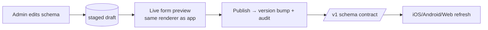

# 06 — Dashboard (Admin CMS) Architecture

The dashboard is the **control room** of the platform and the **source of truth for marketplace structure**. It is where non-engineers create the marketplace: categories/attributes (the schema engine), branding/theme, feature flags, moderation, and content — all without code changes.

## 1. Technology choice — Next.js (App Router) + TypeScript

- **Chosen:** Next.js (App Router) + TypeScript + React. Rationale in [ADR-0010](../adr/0010-dashboard-nextjs.md).
- **Alternatives:**
  - *Refine / React-Admin* — fast CRUD scaffolding; rejected as the primary framework because the Schema Builder and Theme Studio are bespoke, drag-heavy tools that fight admin-scaffold conventions (but we may borrow patterns).
  - *Vue/Nuxt or SvelteKit* — fine, but React has the deepest ecosystem for complex builder UIs (dnd, form engines) and the largest hiring/AI-familiarity pool.
  - *Native SwiftUI/macOS admin* — rejected: web reach, no install, cross-platform admins.
- **Data layer:** the dashboard consumes the **same versioned REST contract** as the apps (admin-scoped endpoints), never the DB directly. It shares generated `contract-types` from `packages/`.

## 2. High-level structure

```
dashboard/
├── app/                       # App Router routes (RSC where useful)
│   ├── (auth)/                # admin login
│   ├── catalog/               # ⭐ Schema Builder: categories, attributes, options
│   ├── listings/              # listing moderation & management
│   ├── config/                # Config Studio: identity, locales, currencies, providers
│   ├── theme/                 # Theme Studio: semantic tokens + live preview
│   ├── flags/                 # Feature flags
│   ├── users/                 # users & roles
│   ├── moderation/            # reports, queue, decisions
│   ├── chats/                 # chat oversight
│   ├── commerce/              # subscriptions, ads, payments, wallet
│   ├── geo/                   # countries, cities
│   ├── notifications/         # broadcast + templates
│   └── analytics/             # dashboards
├── src/
│   ├── api/                   # typed client over the REST contract
│   ├── components/            # design-system-aligned UI
│   ├── features/              # feature modules mirroring app routes
│   └── lib/                   # auth, i18n, permissions
└── ...
```

Each feature module is self-contained (queries, components, forms) — the same modularity discipline as iOS.

## 3. The Schema Builder (most important screen)

The UI counterpart to [05 — Dynamic Schema Engine](05-dynamic-schema-engine.md). It must make editing the marketplace's structure safe and intuitive.

Capabilities:
- **Category tree editor** — create/reorder/nest categories & subcategories (drag-and-drop), localize names, set icons, activate/deactivate.
- **Attribute editor** — per subcategory: attribute groups → attributes; pick `data_type`/`input_type`; set validation, required, default, unit, ordering; localize labels.
- **Option manager** — for enum attributes: add/reorder/localize options; model dependent options (Brand→Model) with parent linkage; bulk import (CSV) for large sets (car models, cities).
- **Dependency builder** — visual rule editor: "Model `options_filtered_by` Brand", "Furnished `visible_when` PropertyType = Apartment".
- **Live preview** — renders the *actual dynamic form* (reusing the same schema contract the app consumes) so admins see exactly what users will see, incl. RTL.
- **Stage → preview → publish** — edits are staged; publishing bumps `schemaVersion` and is audited. Prevents half-edited schemas reaching production.
- **Safety rails** — destructive edits on in-use attributes warn and prefer soft-disable; type changes are guarded.



## 4. Config Studio & Theme Studio

- **Config Studio** edits the **runtime slice** of the Development Schema (locales, currencies, enabled features/modules, provider *selection*, support/social/legal links). Build-time knobs (bundle id, icons, signing) are shown **read-only with guidance** that they require a build — honest about [the runtime/build-time split](README.md#41).
- **Theme Studio** edits **semantic tokens** (see [07 — Theme Engine](07-configuration-whitelabel-theme.md)) with a **live preview** of core components in light/dark and LTR/RTL. Enforces contrast/accessibility checks before publish.

## 5. Permissions & roles

- Role-based access: `super_admin`, `admin`, `catalog_editor`, `moderator`, `support`, `finance`, `read_only`.
- Enforced **server-side** by admin-scoped endpoints (RLS + scope checks); the dashboard UI only hides what the token can't do — it never relies on client-side hiding for security.
- All admin mutations are audited.

## 6. Realtime & operational UX

- Moderation queue and chat oversight use Realtime subscriptions (through the contract) for live updates.
- Optimistic updates with server reconciliation for snappy editing; conflicts surfaced clearly (last-writer-wins with audit, or version guard on schema publish).

## 7. Deployment

- Deployed as a standard Next.js app (Vercel or containerized) per environment; talks to the matching backend environment.
- One dashboard build serves all clients in shared-tenant mode; in single-tenant-per-deployment mode, each client gets its own dashboard instance pointed at its backend (same code, different config).

## 8. Why the dashboard shares the contract (not a private API)
Using the **same REST contract** as the apps means: the Schema Builder's "preview" is guaranteed faithful (identical metadata), admin and app stay in lockstep, and the contract gets battle-tested by two consumers. Admin-only capabilities are additional **scoped endpoints**, not a separate backend.
