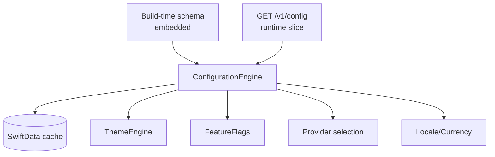
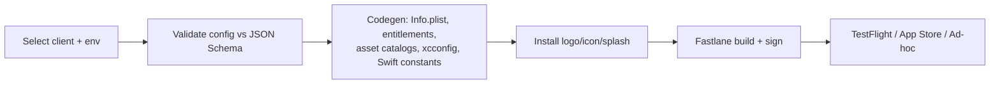
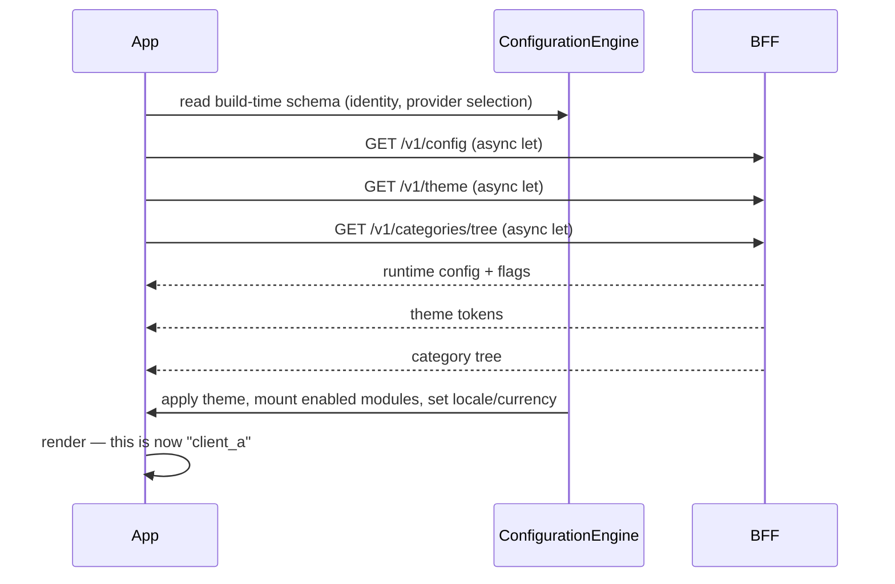

# 07 — Configuration, White-Label & Theme Engine

Three tightly related systems: the **Development Schema** (the config contract), the **white-label pipeline** (turning config into branded apps), and the **Theme Engine** (turning branding into a live UI). Together with the [Dynamic Schema Engine](05-dynamic-schema-engine.md), these are what make one codebase become N products.

## 1. The Development Schema

The **Development Schema** is the versioned, backend-compatible source of truth for *what an application is*. One schema = one marketplace's identity, branding, capabilities, and providers. It is shared conceptually across iOS, Android, Web, Dashboard, and Backend so all stay consistent.

### 1.1 Build-time vs. runtime split (a deliberate, honest boundary)

Not everything can change at runtime. We split the schema into two slices (see [challenged assumption 4.1](README.md#41)):

| Slice | Examples | Where it lives | How it changes |
|---|---|---|---|
| **Build-time** | Bundle identifier, app name, app icon, splash, URL schemes / associated domains, push/sign-in-with-apple entitlements, signing | `configs/clients/<c>/app.json` + assets | Drives Fastlane + codegen at build; requires a new binary |
| **Runtime** | Colors/typography/theme, enabled features/modules, locales, currencies, categories link, provider *selection*, support/social/legal links, feature flags | Backend `config` schema, fetched at boot | Editable in dashboard; live via config refresh |

**Consequence for the roadmap:** the white-label pipeline generates build-time artifacts; the dashboard controls runtime config. Both validate against the **same JSON Schema** in `contract/schema/`.

### 1.2 Schema layout

```
configs/
├── development/               # env overlays
├── staging/
├── production/
└── clients/
    ├── default/               # canonical reference config (CI target, fully populated)
    │   ├── app.json           # build-time identity/signing
    │   ├── config.json        # runtime: locales, currencies, features, providers
    │   ├── theme.json         # semantic tokens (seed; dashboard can override at runtime)
    │   └── assets/            # logo, icon, splash
    ├── client_a/
    └── client_b/
```

Effective config = `default` **deep-merged** with `clients/<c>` **overlaid** with `env/<e>`. Merge order and precedence are defined and tested. The default config is always complete so any client only specifies overrides.

### 1.3 Schema is validated, not free-form

Every config is validated in CI against `contract/schema/*.schema.json` (JSON Schema). An invalid config (bad currency code, missing required brand asset, unknown feature key) **fails the build**. This turns "configuration" into a safe, checkable artifact rather than a source of runtime surprises.

**Merge applies per file, not uniformly** (refined in Phase 0 implementation, see [ADR-0004](../adr/0004-configuration-engine.md)): `config.json` and `theme.json` deep-merge (`default` ← client overlay ← env overlay); `app.json` does **not** merge — every client supplies one complete, independently-valid document, because build identity (bundle id, URL scheme, entitlements) has no safe implicit default. See [contract/README.md](../../contract/README.md#development-schema-merge-model) for the exact validation strategy (full schema for `default` and for the merged result; a structurally-derived partial schema — same constraints, `required` stripped — for overlay files).

### 1.4 Versioning

- The schema format is versioned (`schemaFormatVersion`); config documents declare which format they target.
- Backend stores config snapshots with a `configVersion`; clients cache and refresh on version change (ETag).
- Format migrations ship with upgraders so old client configs migrate forward.

## 2. Configuration Engine (client side)

The iOS `Configuration` module:
1. Loads the **build-time** schema embedded in the app (identity, defaults, provider selection).
2. On boot, fetches the **runtime** config bundle from `GET /v1/config` (locales, currencies, features, theme, flags), concurrently with theme and category tree.
3. **Caches** it in SwiftData for offline; backend remains source of truth.
4. Exposes typed, injected accessors (`AppConfig`, `FeatureFlags`, `LocaleConfig`, `CurrencyConfig`) — **no hardcoded currency/country/business constants anywhere** (a foundation hard rule).



## 3. White-Label pipeline (build-time)

Turning `clients/<c>` into a branded, signed app must be scripted and reproducible — never manual.



- A CLI (`tooling/whitelabel`) takes `--client <c> --env <e>` and produces a configured Xcode build.
- **App name, bundle id, icons, splash, URL schemes, entitlements** are generated from `app.json` + assets — no hand-editing `Info.plist`.
- Fastlane lanes per client/env handle signing, TestFlight, and store metadata (localized).
- The pipeline is the same for CI: adding a client is adding a `clients/<c>` folder + assets, then running the lane.

**Alternative considered:** a single universal binary that switches brand at runtime from a menu (like a demo shell). Rejected for production because bundle id / icon / entitlements are inherently per-app on the App Store — but this *demo shell mode* is valuable for QA and sales and will be supported as a debug build variant that can load any `clients/<c>` runtime config.

## 4. Theme Engine

A **semantic design-token system**. Views reference *roles*, never raw colors. Changing the theme (in config or dashboard) restyles the whole app with no code change — the foundation's explicit requirement.

### 4.1 Token layers

```
Primitive tokens      →  Semantic tokens        →  Component tokens
(#FF7A00, Inter-600,  →  color.primary,         →  button.primary.background,
 space-4, radius-8)      text.primary, surface,     card.border, tabBar.tint
                         danger, separator, glass
```

- **Primitives** = the raw palette/scale (brand-provided).
- **Semantic** = the vocabulary views use: `primary, secondary, accent, background, surface, card, border, textPrimary, textSecondary, placeholder, success, warning, danger, info, separator, overlay, skeleton, loading, selection, navigation, toolbar, tabBar, glass, material, interactive, badge, favorite, online, offline` (the full list from the foundation).
- **Component tokens** = optional per-component overrides mapping to semantics.

### 4.2 Implementation (iOS)

- `DesignSystem` exposes a `Theme` with semantic accessors surfaced through the SwiftUI `Environment` (`@Environment(\.theme)`), plus `Color`/`Font` extensions so components read `theme.color.primary`, never `Color(hex:)`.
- Light/dark and **RTL** are first-class; each semantic token resolves per color-scheme and the design system mirrors layout for RTL automatically.
- Themes come from (a) the seed `theme.json` and (b) runtime overrides from `GET /v1/config`/Theme Studio — merged, cached, hot-swappable.
- **Lint rule:** raw color/font literals outside `DesignSystem` fail CI. This structurally enforces "never hardcode colors."

### 4.3 Alternatives considered
- *Asset-catalog named colors only* — native, but not runtime-driven from backend and awkward for the full semantic set + RTL logic. Rejected as the sole mechanism (we still use asset catalogs for launch/icon).
- *Chosen:* a typed token layer resolved at runtime with an asset-catalog fallback — backend-driven, testable, and swappable. See [ADR-0005](../adr/0005-theme-engine.md).

## 5. Feature Flags

Feature flags gate modules and capabilities per client/environment, and enable safe rollout.

- **Model:** flags are part of the runtime config; typed keys (an enum in code generated from `contract/schema`) so referencing an unknown flag is a compile error.
- **Scopes:** flags can be set per **tenant/client**, per **environment**, and (later) per **user segment** for gradual rollout / A-B.
- **Two flag kinds:**
  - *Capability flags* — is the Wallet module enabled for this client? Drives which coordinators/tabs mount and which endpoints are exposed.
  - *Operational flags* — kill-switches / rollout toggles for a feature already shipped.
- **Evaluation:** resolved server-side and delivered in the config bundle; clients read cached values with a sensible default when offline. Critical kill-switches can be fetched fresh.
- **Discipline:** flags are documented, owned, and have a removal plan (avoid permanent flag debt). See [ADR-0008](../adr/0008-feature-flags.md).

**Alternative considered:** a third-party flag service (LaunchDarkly/ConfigCat). Rejected for v1 to avoid another vendor and because flags are naturally part of our backend-driven config; the abstraction allows adopting one later behind the same `FeatureFlags` port.

## 6. How the three white-label engines compose at boot



The app that boots is entirely determined by config + theme + schema. No branch in code says "if client_a". This is the white-label thesis realized.
