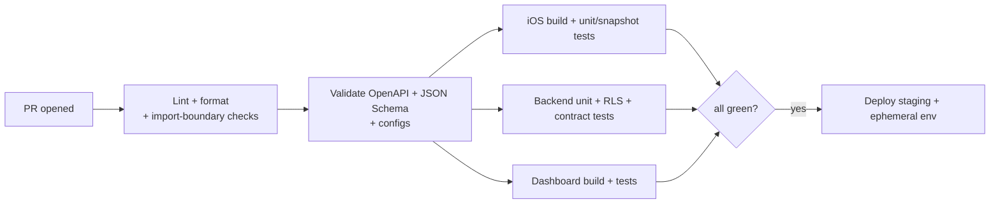

# 09 — Cross-Cutting Concerns

Testing · CI/CD · Security · Performance · Scalability · Observability · i18n/RTL · Documentation.

---

## Testing strategy

**Philosophy:** the test pyramid, weighted to fast unit tests of the domain, with targeted integration/contract/snapshot tests where the platform's risk concentrates (the schema engine, the theme engine, and the contract).

### iOS
| Level | Target | Tooling |
|---|---|---|
| Unit | Use cases (pure), mappers, validators, dependency resolver | Swift Testing / XCTest, fake repositories |
| ViewModel | State transitions + emitted navigation intents | fake use cases |
| Repository | DTO↔Entity mapping, cache policy | mock `APIClient` + `contract/examples` fixtures |
| Snapshot | DynamicForms across representative schemas (Cars/Apartments/Phones) × {LTR,RTL} × {light,dark}; DesignSystem components per theme | swift-snapshot-testing |
| DI graph | Resolve full object graph → catch missing registrations | Factory test |
| UI (thin) | Critical golden-path flows (post a listing, search/filter) | XCUITest, minimal |

### Backend
| Level | Target |
|---|---|
| Unit | domain services, validators, filter-grammar compiler |
| DB | RLS policies (positive + negative per role/tenant), triggers, attribute-value type enforcement, migrations apply cleanly |
| Contract | endpoints conform to OpenAPI; example fixtures round-trip |
| Integration | end-to-end per bounded context against a disposable Supabase (local) |

### Dashboard
- Component/unit tests; Schema-Builder integration tests that publish a schema and assert the emitted contract matches what the app would render (shared fixtures).

### White-label / config
- **Config validation tests:** every `configs/**` document validates against JSON Schema in CI.
- **Representative-config matrix:** snapshot the theme/schema renderers against a *small curated set* of configs (default + 2 contrasting clients + RTL) — not the full combinatorial space (see [risk 4.4](README.md#44)).

**Coverage targets:** domain/use-case layers ≥ 85%; RLS policies 100% of tables have positive+negative tests; contract endpoints 100% covered by conformance tests. Coverage is a floor, not a goal — golden-path behavior is what's asserted.

---

## CI/CD strategy

### Pipeline (per PR)

- **Path-scoped jobs:** monorepo CI runs only affected targets (iOS/backend/dashboard/contract) based on changed paths — keeps CI fast.
- **Boundary enforcement in CI:** grep/AST checks for `import Supabase` outside `Networking`, raw color/font literals outside `DesignSystem`, and Feature→Feature imports. These *fail the build* — architecture rules are executable, not aspirational.
- **Contract gates:** any change to `contract/openapi` runs consumer+provider conformance; breaking changes require a version bump and a migration note.

### Delivery
- **Backend:** migrations + Edge Functions deployed via CI to staging → (manual approve) → production. Migrations forward-only; deploys are reproducible from the repo.
- **iOS:** Fastlane lanes per client/env → TestFlight (staging) → App Store (production). White-label pipeline ([07 §3](07-configuration-whitelabel-theme.md#3-white-label-pipeline-build-time)) parameterizes by client.
- **Dashboard:** standard web deploy per environment.
- **Release trains:** semantic versioning; `CHANGELOG.md` maintained; ADRs updated when decisions change. See [ADR-0014](../adr/0014-ci-cd.md).

---

## Security

| Area | Measure |
|---|---|
| Transport | TLS everywhere; optional cert pinning per client |
| AuthN | Wrapped Supabase Auth; short-lived JWT + Keychain refresh; OTP rate-limited |
| AuthZ | Dual enforcement: Edge Function scope checks **+** RLS; deny-by-default |
| Tenant isolation | `tenant_id` claim + RLS on every table |
| Secrets | Server-side only (function secrets); none in app bundle or repo; config references *selection*, not keys |
| Input | Server-authoritative validation from attribute metadata; parameterized queries only; strict body validation (zod from contract) |
| Storage | Signed URLs, authz+quota-checked uploads, no public buckets |
| Media safety | Upload moderation hook (size/type/optional content scan) |
| Abuse | Rate limiting per token/IP; OTP/SMS abuse protection; listing spam heuristics feeding moderation |
| Audit | All admin/schema/config/moderation mutations logged immutably |
| Privacy | PII minimization; account deletion + data export endpoints (store-compliance & GDPR-style); per-country data residency via per-deployment region |
| Dependencies | SCA scanning in CI; pinned versions; review of new deps |
| Mobile | No sensitive logs in release; jailbreak-aware for high-risk actions (optional); App Transport Security enforced |

A dedicated `SECURITY.md` and threat-model doc are produced during implementation. Payment flows follow provider PCI guidance (no raw card data touches our servers — tokenized via provider SDKs).

---

## Performance

**Client (iOS):**
- Concurrent boot (`async let` config+theme+schema); render from cache immediately, refresh in background.
- List virtualization + image downsampling + `AsyncImage` caching; shimmer/skeleton while loading.
- Debounced search; cursor pagination; prefetch next page.
- Avoid main-thread work; `@MainActor` only for UI; heavy mapping off-main.
- Instrument cold-start, time-to-first-listing, scroll hitch rate.

**Backend:**
- Composed schema endpoint is cacheable (ETag) and cheap; category tree cached.
- Feed/search queries hit indexed paths (generated columns + GIN); N+1 avoided via set-based SQL and views.
- Edge Function cold-start mitigated by keeping functions small and warm paths lean; heavy reads via materialized views.
- Media served from Storage/CDN, not through functions.

**Budgets (initial targets, refined with real data):** app cold start < 2s to interactive (cached); listing feed p95 < 400ms server; schema fetch p95 < 200ms (or 304); search p95 < 600ms.

---

## Scalability

Designed to scale by *escape hatches behind stable contracts*, not premature complexity:

| Dimension | v1 | Scale path |
|---|---|---|
| Search/filter | Postgres FTS + GIN + generated columns | Meilisearch/Typesense/OpenSearch **behind the same `/v1/listings` endpoint** — clients unaffected |
| Read load | Edge Functions + Postgres | read replicas; materialized views; CDN caching of public reads |
| Data volume | single Postgres | partition `listing`/`message` by tenant/date; archive cold data |
| Chat/realtime | Supabase Realtime | dedicated socket tier behind the channel contract if volume demands |
| Backend compute | Edge Functions | re-host contract on NestJS/Go for heavy domains — no client change |
| Multi-client | single-tenant deployments | shared multi-tenant mode (schema already tenant-aware) |
| Media | Storage + CDN | image pipeline / transformations service |

The recurring pattern: **the contract is the firewall.** Every scale move happens behind it, so clients never rewrite.

---

## Observability

- Structured JSON logs with `requestId`/`X-Request-Id` correlation client→function→DB.
- Metrics per endpoint (latency, error rate, cold starts), DB query timings, cache hit rates.
- Error tracking (e.g., Sentry) on iOS + dashboard + functions, correlated by request id.
- Product analytics behind an **analytics port** (provider config-driven), event taxonomy documented; privacy-respecting.
- Dashboards + alerts for golden-path SLOs (post-listing success rate, auth success rate, schema fetch errors).

---

## Internationalization & RTL (day-one)

- **Arabic-first + English** from the first component; RTL is a first-class layout mode, not a retrofit.
- All UI strings localized; **all backend-authored content** (category/attribute labels, options, config text) is i18n JSON with a defined fallback locale.
- Locale-aware number/date/currency formatting driven by config (no hardcoded currency/country — foundation hard rule).
- Bidirectional text handling, mirrored icons/controls, and RTL snapshot tests in the DynamicForms + DesignSystem suites.
- Locale is part of runtime config; adding a language is a config + translation task, not code.

---

## Documentation strategy

Documentation is a **first-class deliverable**, produced alongside code (foundation mandate).

- **Repo root docs** (created during implementation): `README, ARCHITECTURE, SYSTEM_DESIGN, DATABASE, API, BACKEND, IOS_ARCHITECTURE, ANDROID_STRATEGY, WHITE_LABEL, THEME_ENGINE, CONFIGURATION_ENGINE, MODULES, SECURITY, DEPLOYMENT, TESTING, CONTRIBUTING, ROADMAP, CHANGELOG`.
- **Per-module docs** (foundation standard): every feature package ships `README, Architecture, Flow, API, Testing, Future.md`.
- **ADRs** in `docs/adr/` for every significant decision — see the [ADR index](../adr/README.md).
- **Contract docs** auto-generated from OpenAPI; **schema/config docs** from JSON Schema.
- **Definition of Done includes docs:** a feature isn't complete until its module docs and any ADR/roadmap updates are in the same PR. CI checks that new feature packages contain the required doc set.
- **Written for humans and AI agents:** consistent structure, explicit boundaries, and cross-links so a future Claude Code session can navigate by docs alone.
