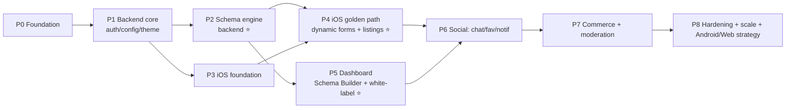

# 11 — Implementation Roadmap

Dependency-ordered, thin-vertical-slice delivery. Each phase has a **goal**, **scope**, **dependencies**, **exit criteria** (demoable), and **artifacts** (code + docs + ADRs). The ordering builds the **foundation → the flagship engine → the golden path that proves the thesis → white-label proof → the rest**. Sizes are indicative T-shirt estimates, not commitments.

**Guiding rule:** don't build a feature until the layer it stands on is complete and documented (foundation's staged-development mandate). The forcing function for phases 0–5 is a single sentence: *"post a listing and filter results across three structurally different verticals, driven entirely by dashboard-defined schema, with zero vertical-specific code — and do it again as a second branded client from config only."*

⭐ = thesis-critical. The platform is *proven* at the end of **P5**; everything after is breadth.

---

## Phase 0 — Foundation & scaffolding  `[Size: M]`
**Goal:** the skeleton every other phase stands on; make architecture rules executable from day one.
**Scope:**
- Monorepo layout ([01 §3](01-system-architecture.md#3-repository-structure-monorepo)); root docs stubs; `CONTRIBUTING`, `CHANGELOG`.
- `contract/` bootstrapped: OpenAPI `v1` skeleton, JSON Schema for the **Development Schema** (build-time + runtime), `contract/examples` scaffold.
- `configs/clients/default` **canonical reference config** (fully populated) + `client_a` stub; env overlays.
- `packages/config-validation` + `packages/contract-types` codegen wired.
- CI: path-scoped jobs, config/OpenAPI validation, lint + **boundary checks** (no `import Supabase` outside Networking; no raw colors outside DesignSystem; no Feature→Feature imports).
- Local dev: Supabase local, seed harness stub.
**Dependencies:** none.
**Exit criteria:** CI green on an empty-but-valid contract + default config; `whitelabel validate --client default` passes; boundary lints active.
**Artifacts:** ADR-0009 (monorepo), ADR-0004 (config engine), ADR-0006 (API contract), ADR-0014 (CI/CD).

## Phase 1 — Backend core: DB, auth, config & theme contract  `[Size: L]`
**Goal:** a working data plane + the app-boot contract (auth, config, theme).
**Scope:**
- Postgres schemas ([04](04-database-architecture.md)) for `platform, identity, config`; tenancy (`tenant_id`) + RLS scaffolding; migrations + seed harness.
- Auth wrap: `/v1/auth/*` Edge Functions over Supabase Auth (email/password, OTP, Apple/Google, anonymous); Keychain-ready token contract ([08 Part B](08-api-auth.md#part-b--authentication-strategy)).
- Config + theme: `config` tables, `/v1/config`, `/v1/theme`, ETag/versioning; seed default config/theme.
- `_shared` runtime: auth middleware, error envelope, zod validation from contract.
**Dependencies:** P0.
**Exit criteria:** an anonymous client can `GET /v1/config` + `/v1/theme` (cacheable), and a user can complete OTP + email/Apple auth against the contract; RLS positive/negative tests pass.
**Artifacts:** ADR-0002 (BFF), ADR-0007 (auth), ADR-0011 (tenancy); `DATABASE.md`, `BACKEND.md`, `API.md` first cut.

## Phase 2 — Dynamic Category & Attribute Engine (backend) ⭐  `[Size: L]`
**Goal:** the flagship, server-side and proven at scale.
**Scope:**
- `catalog` + `listing` schema: categories (self-ref tree), attribute groups, attributes, options (with dependent options), dependencies; hybrid value store + `attributes_index` + triggers + type enforcement ([05](05-dynamic-schema-engine.md)).
- Contract: `/v1/categories/tree`, `/v1/categories/{id}/schema`, `/v1/attributes/{id}/options`, `/v1/listings` (create + list + filter grammar).
- Seed the **default marketplace**: all 11 top categories, subcategories, with Cars/Apartments/Phones fully modeled.
- **Performance benchmark** against 100k+ synthetic listings; establish filter-latency budget; add generated columns for hot fields.
**Dependencies:** P1.
**Exit criteria:** create + filter listings across Cars/Apartments/Phones purely via metadata; benchmark meets p95 filter budget or the search-engine escape hatch is validated; RLS + attribute-type triggers tested.
**Artifacts:** ADR-0003 (dynamic attribute engine); `05` kept in sync; schema seed docs.

## Phase 3 — iOS foundation  `[Size: L]`  *(parallelizable with P2 after P1)*
**Goal:** the app skeleton and the abstractions that guarantee portability.
**Scope:**
- SPM workspace; `Core`, `Networking` (APIClient/APIEndpoint + interceptors, Supabase isolated), `Configuration` (build-time + runtime + SwiftData cache), `DesignSystem` (theme engine + core components: buttons/cards/inputs/search/sheets/dialogs/snackbars/loading/shimmer/empty/error/offline), `DomainKit`, `DataKit`.
- App shell: `App` composition root, Factory registrations, `AppCoordinator` + `TabCoordinator`, boot sequence (concurrent config+theme fetch), auth flow UI.
- RTL/i18n plumbing; snapshot infra.
**Dependencies:** P1 (contract for config/theme/auth). Can start against contract mocks before P2 finishes.
**Exit criteria:** app boots, fetches config+theme, renders themed shell + auth in LTR **and** RTL, light **and** dark; DI graph resolves; theme swap restyles the whole app; no Supabase import outside Networking (CI-enforced).
**Artifacts:** ADR-0001 (clean arch), ADR-0005 (theme), ADR-0012 (DI), ADR-0013 (persistence), ADR-0015 (iOS modularization); `IOS_ARCHITECTURE.md`, `THEME_ENGINE.md`, `DesignSystem` module docs.

## Phase 4 — iOS golden path: DynamicForms + Listings ⭐  `[Size: L]`
**Goal:** prove *schema-driven, not screen-driven* on-device.
**Scope:**
- `DynamicForms` field-type registry + dependency/validation engine ([05 §6](05-dynamic-schema-engine.md#6-dynamic-form-rendering-client)).
- `Features/Listings`: dynamic create-listing form, listing feed, listing detail (schema-projected), media upload.
- `Features/Search`: dynamic filters from `filterable` attributes, results, sort, pagination.
- End-to-end: post a Car, an Apartment, a Phone — same code, three schemas.
**Dependencies:** P2 (schema+listing contract), P3 (iOS foundation).
**Exit criteria:** **the golden path** — create + browse + filter listings for 3 structurally different verticals with zero vertical-specific screen code; edit a schema server-side → app reflects it after refresh, no rebuild; DynamicForms snapshot tests pass across verticals × {LTR/RTL} × {light/dark}.
**Artifacts:** `Features/Listings` + `Features/Search` module docs (README/Architecture/Flow/API/Testing/Future); `MODULES.md`.

## Phase 5 — Dashboard + White-label proof ⭐  `[Size: L]`
**Goal:** put the marketplace's structure and branding in non-engineers' hands, and **prove a second client from config only.**
**Scope:**
- Dashboard ([06](06-dashboard-architecture.md)): admin auth, **Schema Builder** (category tree, attribute editor, option/dependency editor, localize, stage→preview→publish), **Config Studio**, **Theme Studio** with live preview.
- Admin-scoped endpoints (`/v1/admin-catalog`, `/v1/admin-config`) + audit log.
- White-label pipeline ([07 §3](07-configuration-whitelabel-theme.md#3-white-label-pipeline-build-time)): `whitelabel build --client <c>`; Fastlane lanes; codegen for identity/icons/entitlements.
- **Proof:** build `client_a` and `client_b` — different brand, locale, theme, enabled categories — **from config only**.
**Dependencies:** P2, P4.
**Exit criteria:** an admin creates a new subcategory + attributes + dependency + localization in the dashboard, publishes, and the iOS app renders it — no code. Two distinct branded apps ship from config with **zero source changes**. (This is the platform thesis, proven.)
**Artifacts:** ADR-0010 (dashboard), ADR-0008 (flags); `WHITE_LABEL.md`, `CONFIGURATION_ENGINE.md`, `DEPLOYMENT.md`; dashboard module docs.

> **Milestone: Platform MVP proven.** After P5, the product does what it exists to do. Ship a real pilot marketplace here. Everything below is breadth added behind feature flags.

## Phase 6 — Social & engagement  `[Size: L]`
**Goal:** the interactions that make a classifieds marketplace usable.
**Scope:** Chat (Realtime + moderation hook + push fan-out), Favorites, Notifications, Reviews/ratings, Seller profiles, Home feed composition.
**Dependencies:** P4, P5.
**Exit criteria:** buyer↔seller chat on a listing, favorite/unfavorite, receive a push, view a seller profile — all flag-gated per client.
**Artifacts:** module docs per feature; `notifications`/`chat` context docs.

## Phase 7 — Commerce, monetization & trust  `[Size: L]`
**Goal:** revenue + safety.
**Scope:** Subscriptions & plans, Payments (provider **port** + first concrete provider), Wallet, Advertisements/promotions, Moderation queue + Reports workflow in dashboard.
**Dependencies:** P5, P6.
**Exit criteria:** a seller subscribes/pays via the payment port; an ad/promotion surfaces; a reported listing flows through moderation to a decision — all audited and flag-gated. Provider chosen per [open decisions](README.md#6-open-decisions-requiring-your-ratification-product-level).
**Artifacts:** payments/subscriptions/moderation docs; ADR for the chosen provider(s).

## Phase 8 — Hardening, scale & next platforms  `[Size: M-L]`
**Goal:** production-grade durability and the on-ramp to Android/Web.
**Scope:** load/perf hardening against budgets; search-engine adoption if needed; observability/alerting SLOs; security review + threat model; accessibility pass; `ANDROID_STRATEGY.md` + web strategy (both consume the *same contract*, reuse the schema/theme metadata — mostly a client build, not new backend).
**Dependencies:** all prior.
**Exit criteria:** SLOs met under load; security review closed; Android/Web strategy documented and contract-ready.
**Artifacts:** `SECURITY.md` (final), `SYSTEM_DESIGN.md` (final), `ANDROID_STRATEGY.md`, scale ADRs.

---

## Parallelization & critical path
- **Critical path:** P0 → P1 → P2 → P4 → P5.
- **P3 runs in parallel with P2** (iOS foundation against contract mocks) once P1's contract lands — this compresses the schedule meaningfully.
- Within P4/P5, DynamicForms (iOS) and Schema Builder (dashboard) can progress in parallel against the shared contract, meeting at the "edit-in-dashboard → renders-in-app" exit criterion.

## What each phase must not skip
- **Docs in the same PR** (module docs + ADR/roadmap updates) — a phase isn't done until documented.
- **Boundary lints stay green** — the portability guarantees are only real if enforced continuously.
- **A demoable slice** — every phase ends with something you can run and show, not just merged code.

## Definition of Done (per phase)
1. Exit criteria demoed. 2. Tests at target coverage + golden-path assertions. 3. Module/ADR/roadmap docs updated. 4. Boundary + contract lints green. 5. `CHANGELOG` updated. 6. Deployed to staging.
